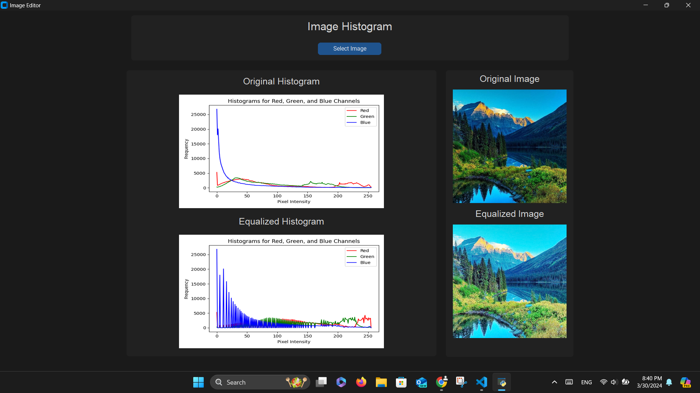

# **Histogram Assignment**

In this assignment I developed program in python which takes an image, plot a histogram of the image, equalize it and then display the results.

## **GUI Preview**!

 

## Code explanation

Before starting make sure to get all required libraries using:

```
pip install -r requirements.txt
```

To make the GUI I used [CustomTkinter](https://github.com/TomSchimansky/CustomTkinter), I created the frames and labels and the button to let the user selects the image.

After pressing the button, the openfn function will alow the user broswe to select the image and then set the image path a global variable to be accessed anywhere in the code:

```
def openfn():
    # Let user selects the image
    global filename
    filename = filedialog.askopenfilename(title="Open")
```

---

To calculate and plot the histogram the plot_histograms function will be used, which returns the histogram figure:

```
def plot_histograms(image):
    # Calculate histograms for each channel R,G and B
    hist_red = cv2.calcHist([image], [0], None, [256], [0, 256])
    hist_green = cv2.calcHist([image], [1], None, [256], [0, 256])
    hist_blue = cv2.calcHist([image], [2], None, [256], [0, 256])

    # Plot histograms
    fig, ax = plt.subplots(figsize=(6, 4))
    ax.plot(hist_red, color="red", label="Red")
    ax.plot(hist_green, color="green", label="Green")
    ax.plot(hist_blue, color="blue", label="Blue")
    ax.set_title("Histograms for Red, Green, and Blue Channels")
    ax.set_xlabel("Pixel Intensity")
    ax.set_ylabel("Frequency")
    ax.legend()

    return fig
```

---

To be able to display the histogram figures in the GUI, I had to save it as a .png and then re-open it again:

```
# Function to display histograms
def display_histogram():
    # Load the image
    global filename
    image = cv2.imread(filename)

    # Plot histograms and display inside the GUI
    fig = plot_histograms(image)

    # Convert the plot to an image and save it
    plt.tight_layout()
    plt.savefig("histogram.png")
    plt.close()

    # Load the saved image
    hist_image = Image.open("histogram.png")
    hist_image = customtkinter.CTkImage(hist_image, size=(450, 250))

    # Display the image in Tkinter window
    label_histogram.configure(image=hist_image)
    label_histogram.image = hist_image
    labelhist.pack(pady=10)
    label_histogram.pack(pady=5)

    # Plot histograms and display inside the GUI
    equalized_image = hist_equalize_color(image)
    fig = plot_histograms(equalized_image)

    # Convert the plot to an image and save it
    plt.tight_layout()
    plt.savefig("histogrameq.png")
    plt.close()

    # Load the saved image
    hist_imageeq = Image.open("histogrameq.png")
    hist_imageeq = customtkinter.CTkImage(hist_imageeq, size=(450, 250))

    # Display the image in Tkinter window
    label_histogrameq.configure(image=hist_imageeq)
    label_histogrameq.image = hist_imageeq
    labelhisteq.pack(pady=10)
    label_histogrameq.pack(pady=5)
```

---

To equlize the colors, you can see that I used BRG, that is because in OpenCV, the default color space order for reading images is BGR (Blue-Green-Red), not RGB. Here are the stpes I used to equalize the image:

1. Split the Image into Color Channels
2. Initialize the Histogram Array
3. Compute the Histogram
4. Normalize the Histogram
5. Calculate the Cumulative Distribution Function (CDF)
6. Normalize the CDF
7. Map Pixel Intensities to Equalized Values
8. Convert Data Type
9. Return Equalized Image

And here is the code:

```
def hist_equalize_color(image):
    b, g, r = cv2.split(image)

    # Initialize the histogram array
    histogram = np.zeros(256)

    # Iterate over each pixel in the image and update the histogram
    for i in range(image.shape[0]):
        for j in range(image.shape[1]):
            histogram[r[i, j]] += 1
            histogram[g[i, j]] += 1
            histogram[b[i, j]] += 1

    # Normalize the histogram by dividing each bin by 3
    histogram /= 3

    # Calculate the cumulative distribution function (CDF) from the histogram
    cdf = histogram.cumsum()

    # Normalize the CDF
    cdf_normalized = ((cdf - cdf.min()) * 255) / (cdf.max() - cdf.min())

    # Map the pixel intensities of the original image to their corresponding equalized values
    equalized_image = cdf_normalized[image]

    # Convert the data type of the equalized image to uint8
    equalized_image = equalized_image.astype(np.uint8)

    return equalized_image
```

---

Lastly heres the function to display the images:

```
def show_equalized_image():
    # Load the image
    global filename
    image = cv2.imread(filename)
    img = Image.open(filename)

    # Perform histogram equalization
    equalized_image = hist_equalize_color(image)

    # Convert image to RGB format for displaying in Tkinter
    equalized_image_rgb = cv2.cvtColor(equalized_image, cv2.COLOR_BGR2RGB)

    # Convert image to PIL format
    img_equalized = Image.fromarray(equalized_image_rgb)
    img_equalized = customtkinter.CTkImage(img_equalized, size=(250, 250))

    # Display the image in Tkinter window
    label_equalized.configure(image=img_equalized)
    label_equalized.image = img_equalized

    # Pack the images and labels to the GUI
    img = customtkinter.CTkImage(img, size=(250, 250))
    og_img.configure(image=img)
    labelOg.pack(pady=5)
    og_img.pack(pady=5)
    labelEq.pack(pady=5)
    label_equalized.pack(pady=5)
```

---

## Extra Resources

| Resource                                            | Link                                                             |
| --------------------------------------------------- | ---------------------------------------------------------------- |
| Histogram Equalization on Grayscale and Color Image | https://hypjudy.github.io/2017/03/19/dip-histogram-equalization/ |
| OpenCV Python Tutorial For Beginners 26             | https://www.youtube.com/watch?v=F9TZb0XBow0                      |
| How to Compute the Histogram of a Color Image       | https://www.youtube.com/watch?v=tUs7Glv7lpA                      |
