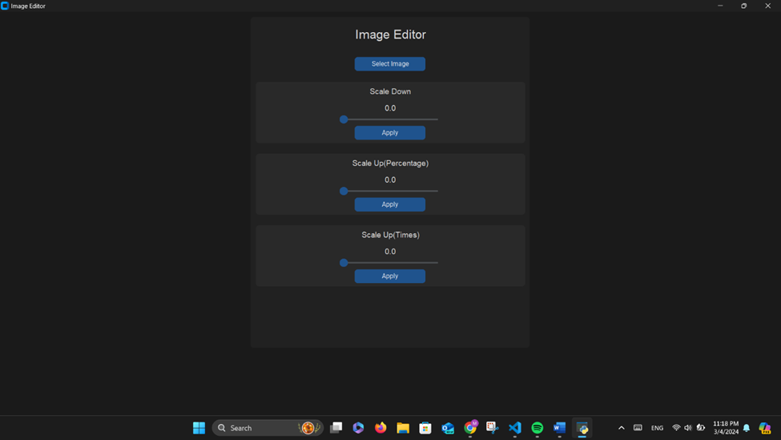

# **Image Editor**

**In this assignment I developed an image editor in pyhton using Jython(jes4py) and made a GUI using CustomTkinter. The Editor can Scale Images Up and Down**

## **Notes**

**Make sure to get all required libraries using:**

```
pip install -r requirements.txt
```

## **GUI Preview**!

 
